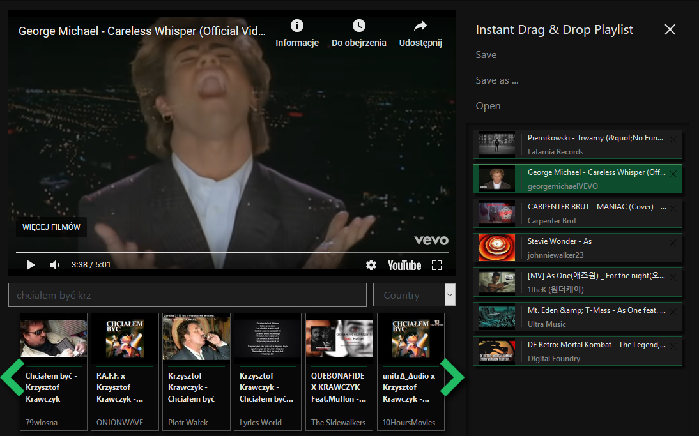

# YT_Party
Search for YouTube videos, add them to instant playlist and change it dynamicly without stoping videos in the same window 

 

<b>install packages</b> 
<code>npm install</code>

<b>run development server</b> on localhost:3000  
<code> npm run start </code>  
<b>production</b>
<code> npm run build </code> 
